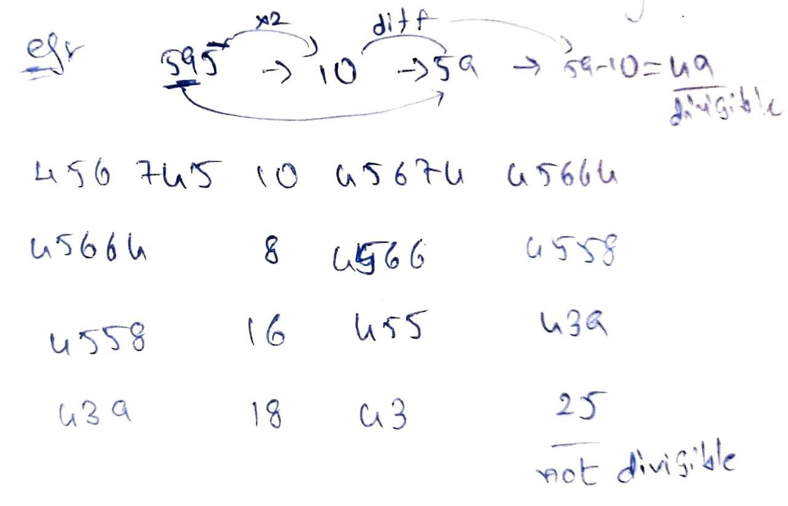

# Numbers

## Types of numbers



* A number which can be expressed in the form $$p/q$$ where p and q are integers and  $$q \neq 0$$.
* Terminating decimals and recurring decimals



* Numbers which are not rational but which can be represented by points on the number line.
* Any non-terminating and non-recurring decimal
* Between any two numbers there are ♾ numbers of irrational numbers



* All numbers having only two distinct factors, the number itself and 1
* Every prime number &gt;3 can be written in the form of 6k+1 or 6k-1 where k is an integer.
* To check if a number ‘p’ is prime, find a number ‘n’ such that ‘n’ is the smallest natural number which satisfies n2 &gt;= p. Now, check if ‘p’ is divisible by any of the prime numbers less than or equal to ‘n’. If ‘p’ is NOT divisible by any such prime numbers, ‘p’ is a prime number. Otherwise, p is not a prime number.



* All numbers greater than 1 which are NOT prime are composite numbers.
* 1 is neither prime nor composite



* also known as relative primes
* Two numbers ‘a’ and ‘b’ are called co-prime if their highest common factor \(HCF\) is 1.
* If ‘p’ and ‘q’ are co-primes and we have a number ‘n’ that is divisible by both ‘p’ and ‘q’, ‘n’ will be divisible by p x q.



* numbers which have sum of factors\(excluding itself and incuding 1\) is equal to number itself.



## Divisibility tests

<table>
  <thead>
    <tr>
      <th style="text-align:left">Divisible by</th>
      <th style="text-align:left">Rule/Condition</th>
    </tr>
  </thead>
  <tbody>
    <tr>
      <td style="text-align:left">2</td>
      <td style="text-align:left">
        
even no as its last number

        
eg: 128,246

      </td>
    </tr>
    <tr>
      <td style="text-align:left">3</td>
      <td style="text-align:left">
        
sum of digits multiple of 3

        
eg: 342

      </td>
    </tr>
    <tr>
      <td style="text-align:left">4</td>
      <td style="text-align:left">
        
last two digits are divisible by 4

        
eg: 1232

      </td>
    </tr>
    <tr>
      <td style="text-align:left">5</td>
      <td style="text-align:left">if the last digit is either 0 or 5.</td>
    </tr>
    <tr>
      <td style="text-align:left">6</td>
      <td style="text-align:left">
        
divisible by both 2 and 3.

        
eg: 114

      </td>
    </tr>
    <tr>
      <td style="text-align:left">7</td>
      <td style="text-align:left">
        
iff repeatedly doing following steps until a single digit left leaves
          the single digit as 0 or 7. (1) Remove the last digit. (2) Subtract double
          of last digit from the number obtained after step 1 (number with last digit
          removed). Example, given number is 196. After removing last digit, we get
          19. After subtracting 12 (double of removed digit), we get 7. Since the
          last left digit is 7, number is multiple of 7.

        

          
        

      </td>
    </tr>
    <tr>
      <td style="text-align:left">8</td>
      <td style="text-align:left">last three digits are divisible by 8</td>
    </tr>
    <tr>
      <td style="text-align:left">9</td>
      <td style="text-align:left">sum of its digits is divisible by 9.</td>
    </tr>
    <tr>
      <td style="text-align:left">11</td>
      <td style="text-align:left">the difference between the sum of numbers at even positions and odd positions
        is either 0 or a multiple of 11.</td>
    </tr>
  </tbody>
</table>

## Factors for a number

* If N is a composite number such that $$N = a^p*b^q*c^r...$$ where a,b,c,... are prime factors of N and p,q,r,... are +ve integer, then  no of factors of N =  $$d = (p+1)(q+1)(r+1)...$$ 
* Total no of prime factors = $$n = p + q + r + ...$$ 
* No of ways of expressing a number as a product of two factors = $$1/2\{(p+1)(q+1)(r+1)...\}$$
* No of ways of expressing a perfect square as a product of two factors are
  * as a product of two different factors\(excluding $$\sqrt N * \sqrt N$$ \)  $$1/2\{(p+1)(q+1)(r+1)...-1\}$$ 
  * as a product of two factors\( including $$\sqrt N * \sqrt N $$\)  $$1/2\{(p+1)(q+1)(r+1)...+1\}$$ 
* Sum of all factors of a number = $$[(a^{p+1} - 1)/(a-1)] * [(b^{q+1} - 1)/(b-1)] * [(c^{r+1} - 1)/(c-1)]...$$ 
* Product of all factors of a number = $$N^{d/2}$$ 
* No of ways of writing N as a product of 2 co-primes = $$2^{n-1}$$ 
* No of co-primes to N, less than N = $$\phi(N) = N*[1-(1/a)]*[1-(1/b)]*[1-(1/c)]*...$$
* Sum of co-primes to N, less than N = $$(N/2 ) * \phi(N)$$ 

## Formulae

* Sum of first n odd numbers = $$n^2$$ 
* Sum of first n even numbers = $$n * (n+1)$$ 
* Sum of squares of first n numbers = $$[n*(n+1)*(2n+1)]\div6$$ 
* Sum of cubes of first n numbers = $$[n^2*(n+1)^2]\div 4$$ 
* Product of two numbers = LCM\*HCF
* $$(x^n - a^n)$$ is divisible by $$(x-a)$$ for all values of n.
* $$(x^n - a^n)$$ is divisible by $$(x + a)$$ for all even values of n.
* $$(x^n + a^n)$$ is divisible by $$(x + a)$$ for all odd values of n.

